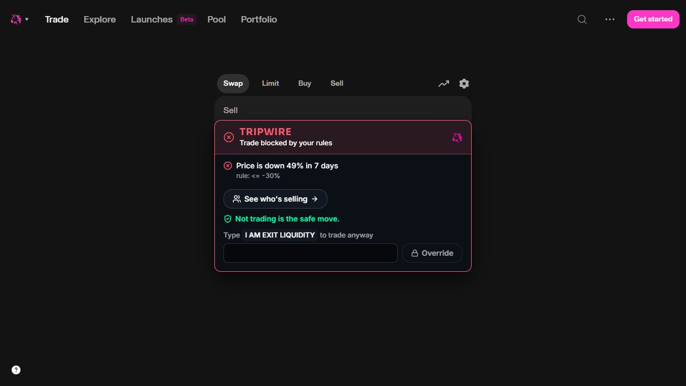
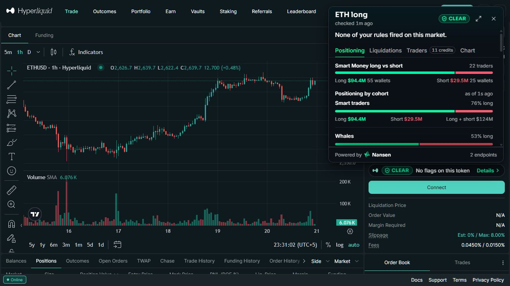
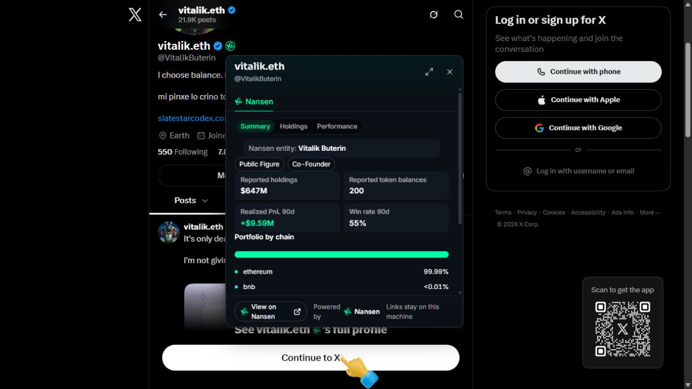
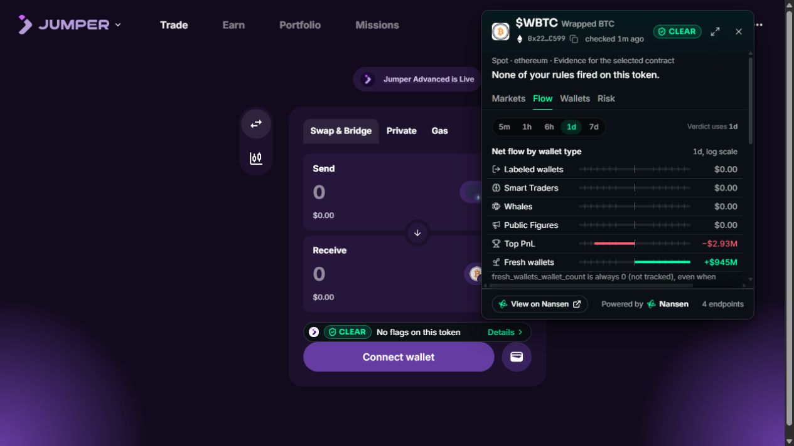
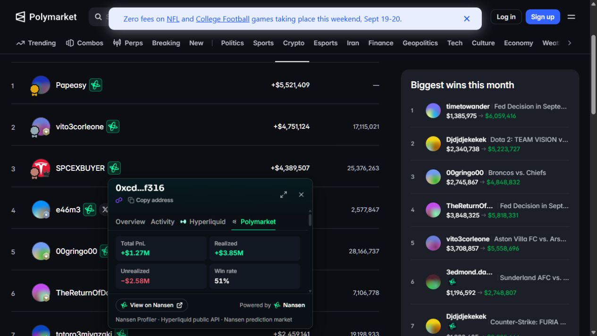
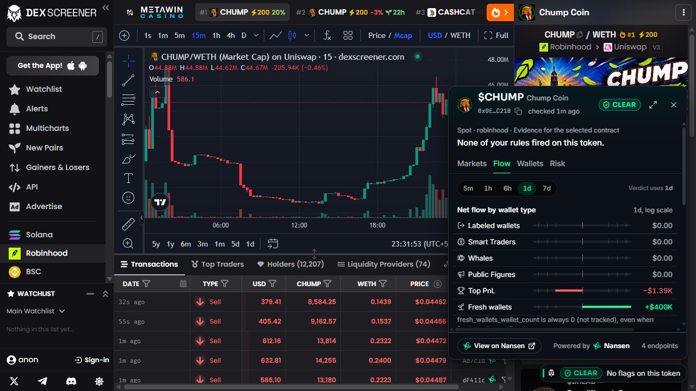

# Tripwire

Nansen onchain intelligence at the moment of decision: on the post that shills a token and on
the button that buys it.

## What it looks like

Unmodified captures from the loaded extension on live public pages (details and source URLs in
[`apps/web/public/showcase/README.md`](apps/web/public/showcase/README.md)). The same six run as
the rotating gallery on the product page at `http://127.0.0.1:3000`.

| | |
|---|---|
| **Uniswap — the block screen.** A real drawdown rule fired on GIZA/Base; the Swap button is covered until you type `I AM EXIT LIQUIDITY`. <br> | **Hyperliquid — perp positioning.** Smart Money long/short split, funding and open interest normalized across five venues, liquidation bands. <br> |
| **X — author badge.** A Nansen entity match beside the profile name opens holdings, tags and realized PnL. <br> | **Jumper — evidence beside the swap.** The token card sits next to the widget, sized to its anchor. <br> |
| **Polymarket — the wallet lens.** Any address on the page opens that wallet's Nansen, Hyperliquid and Polymarket record. <br> | **DEX Screener — the docked verdict.** A tier-2 venue gets the verdict chip and the same evidence card, never a block. <br> |

## What it does

- **On X:** every post that mentions a token gets a verdict chip (TRIPWIRE / CAUTION / CLEAR /
  UNCHECKED; when a post has both a cashtag and a contract address, the address is checked),
  that opens a floating evidence card beside it (not inside the post): tabs for flow
  (buyer/seller flow by wallet type, price since the post, Smart Money netflow), wallets (top
  sellers and buyers) and risk (the rules that fired, risk indicators), plus whether the post's
  author (matched by Nansen entity name) holds the token.
- **On trading venues:** tier-1 venues (Jupiter, pump.fun, Uniswap, Jumper, Hyperliquid,
  Polymarket) get a block screen over the trade/buy/long/short/yes-no button when a rule
  fires, with the Nansen evidence that triggered it and a typed-phrase override. Tier-2
  venues get a docked verdict chip that opens the same evidence card (URL-derived target only,
  nothing to block).
- **Author badges (X):** next to a post author's username, a Nansen badge when that account's
  display name or handle is an exact match for a Nansen entity, plus a Hyperliquid or Polymarket
  badge when a wallet is linked to that handle. Clicking one opens the same floating card with a
  tab per venue: Nansen holdings, tags and realized PnL; Hyperliquid account value, open
  positions and recent fills; Polymarket PnL, win rate, open positions and recent trades. A
  wallet is only ever linked by you (the "Link wallet" form, stored locally) or by a curated,
  source-verified entry in `packages/core/src/curated-wallets.ts` (shipped empty: no candidate
  had a fetchable source where the account itself states the address). Nothing is ever inferred
  from a similar name.
- **Wallet lens (anywhere):** wherever somebody shares a wallet — an address, an ENS name, or a
  link to an explorer, Polymarket profile, Hyperliquid explorer, DeBank, DEX Screener maker or
  Pendle dashboard — a small Nansen mark appears beside it and opens a card with that wallet's
  Nansen holdings and 90-day PnL, its Hyperliquid positions and fills, and its Polymarket
  record. It runs on X and every venue out of the box; anywhere else you turn it on per site
  from the popup, which asks the browser for that one origin. Tripwire never requests
  `<all_urls>` at install and never injects into a site you have not enabled.
- **User-owned rules:** three presets (Degen, Balanced, Paranoid) or a custom rule set,
  editable at `/rules`, evaluated locally against the signals below.
- **Immediate, expandable evidence:** every card opens before its data arrives with shaped,
  reduced-motion-safe loading placeholders. The same card can expand into a desktop overlay
  for larger charts and longer tables; wallet and author cards remember their own size too.
  Expanding is free. Paid depth stays behind a tab that states its credit cost before it runs.
- **Perp market depth:** Hyperliquid cards add positioning, liquidation bands and positions,
  top traders, recent large trades, price/funding charts, order-book depth, and a normalized
  funding/OI comparison across Hyperliquid, Binance, Bybit, OKX, and dYdX. Public exchange
  calls are free, independently failable, cached, and backend-only.

**What it never does:** it never reads, derives or stores a wallet address for an unlabeled X
account; it never signs, sends or intercepts a transaction, and never connects to a wallet;
the Nansen API key never reaches the extension; and it never talks to a third party from your
browser — every request, including token logos, goes through the backend on your own machine.

## Install

Load the extension and you are done: it talks to the hosted backend at
`https://tripwire.magician.wtf`, which holds the Nansen key and pays for the credits. No server,
no key, no settings. Each install gets a generous free daily allowance; past it, the popup offers
to use your own Nansen key, which stays in your browser and is never stored by Tripwire.

Running the hosted backend yourself: [`docs/DEPLOYMENT.md`](docs/DEPLOYMENT.md).

## Self-host (under 10 minutes)

Everything runs on your machine with your own key. In the popup, open settings and choose
"Advanced: self-hosted backend".

**Prerequisites:** Node >= 22.13, pnpm >= 9, Chrome, a Nansen API key
(https://app.nansen.ai/api).

1. Clone the repo.
2. `pnpm install`
3. Provide a Nansen key, either way works:
   - `cp .env.example apps/web/.env.local` and set `NANSEN_API_KEY`, or
   - already logged in with the Nansen CLI (`npm i -g nansen-cli && nansen login`) — the
     backend reuses that key automatically, no `.env.local` needed (ADR-0004).
4. `pnpm -F web dev` — backend at http://127.0.0.1:3000.
5. `pnpm -F extension build`
6. In Chrome: `chrome://extensions` -> enable Developer mode -> Load unpacked ->
   `apps/extension/.output/chrome-mv3`.
7. Open x.com and search `$WIF`, or open
   https://jup.ag/swap?sell=So11111111111111111111111111111111111111112&buy=EKpQGSJtjMFqKZ9KQanSqYXRcF8fBopzLHYxdM65zcjm
   (jup.ag now rewrites the `/swap/<in>-<out>` path form to its default pair; see docs/VENUE-CHECK.md).

**Offline / no key:** `pnpm dev:replay` (any shell) serves recorded real responses
(`fixtures/nansen/`) instead of calling Nansen. By hand: `TRIPWIRE_REPLAY=1 pnpm -F web dev`
(bash) or `$env:TRIPWIRE_REPLAY="1"; pnpm -F web dev` (PowerShell). A REPLAY tag
shows on every web page and on every extension surface (X chip and evidence card, strip, dock,
block screen).

## How the verdict works

Each target (a token, a perp coin + side, or a prediction market + outcome) produces a set of
signals. A signal's `value` is `null` when the underlying Nansen data is unavailable — a
missing signal never counts toward CLEAR.

| Signal | Meaning | Nansen endpoint(s) | Credits |
|---|---|---|---|
| `labeled_exit_pct` | Labeled-wallet net flow as a percentage of the token's own 24h volume; negative means smart traders, whales, and public figures are net selling | `tgm/flow-intelligence`, `tgm/token-information` | 1 + 1/day |
| `distribution_pct` | A labeled exit as a percentage of 24h volume, but only when fresh-wallet buying absorbs the selling; activity and wallet-count guards suppress noise | `tgm/flow-intelligence`, `tgm/token-information` | shared with `labeled_exit_pct` |
| `sm_netflow_pct` | Smart Money 24h net flow as a percentage of the token's 24h volume | `smart-money/netflow`, `tgm/token-information` | 5 + shared denominator |
| `drawdown_pct` | Seven-day price change, falling back to 24h when needed | `tgm/token-ohlcv` | endpoint-reported |
| `risk_high_count` | Count of high-severity token risk indicators (`concentration-risk`, `liquidity-risk`, `token-supply-inflation`) | `tgm/indicators` | 5 |
| `author_holds_token` | Current USD value the matched entity (X post author) holds of the token | `profiler/address/current-balance` | 1 |
| `sm_opposite_side_pct` | Share of Smart Money perp exposure on the side opposite the user's chosen long/short | `perp-screener` | 1 |
| `inside_liq_band` | USD value of Smart Money positions that liquidate within +/-3% of mark price | `tgm/perp-positions` | 5 |
| `smart_side_disagrees` | Share of proven-winner Polymarket money (Yes/No holders only) on the outcome opposite the user's pick | `prediction-market/top-holders`, `prediction-market/pnl-by-address` | 5 + up to 20 × 1 (one PnL call per top holder, each cached 24h) |

Rules compare a signal's value against a threshold and either `warn` or `block`. Three
presets ship in `packages/core/src/rules/presets.ts`:

| Rule | Signal | Degen | Balanced | Paranoid |
|---|---|---|---|---|
| spot-distribution | `distribution_pct` | block < -6% | block < -2% | block < -0.75% |
| spot-exit-deep | `labeled_exit_pct` | block < -10% | block < -5% | block < -2.5% |
| spot-exit | `labeled_exit_pct` | warn < -4% | warn < -1% | warn < -0.5% |
| spot-sm24 | `sm_netflow_pct` | warn < -4% | warn < -1.5% | warn < -0.75% |
| spot-drawdown | `drawdown_pct` | warn <= -80% | warn <= -50% | block <= -30% |
| perp-opp | `sm_opposite_side_pct` | block > 85% | block > 70% | block > 55% |
| perp-liq | `inside_liq_band` | warn > $5,000,000 | warn > $1,000,000 | block > $250,000 |
| pm-smart | `smart_side_disagrees` | block > 85% | block > 70% | block > 55% |

**Verdict:** `TRIPWIRE` (a `block` rule fired) outranks `CAUTION` (only `warn` rules fired),
which outranks `UNCHECKED` (a rule's signal was unavailable, or no rule applies to this
target kind), which outranks `CLEAR` (every applicable rule ran and none fired). A target
Tripwire couldn't fully check is never reported as `CLEAR`. An `UNCHECKED` result carries a short
reason when there is one ("Nansen credit cap reached", "Pick a market", "Pick Yes or No"), shown
on the chip and strip.

## Venues

| Venue | Tier | URL pattern | What's read |
|---|---|---|---|
| Jupiter | 1 | `jup.ag/swap/<in>-<out>`, or `?sell=&buy=` / `?inputMint=&outputMint=` on `/swap` or the root page | spot, output mint (Solana); anchor: the swap form's Swap / Place order / Connect button (logged out it reads "Connect"), never the header Connect |
| pump.fun | 1 | `pump.fun/coin/<mint>` | spot (Solana); anchor: the trade panel's primary action next to its Buy/Sell tabs ("Connect wallet to trade" logged out), never the tabs, quick-buy chips or token-card quick-buys |
| Uniswap | 1 | `app.uniswap.org?outputCurrency=&chain=`, else the Buy field | spot (EVM); anchor: `review-swap` ("Get started" logged out). With no token in the URL the Buy selector is read and the symbol resolved through Nansen; a native coin (ETH) and a chain outside coverage each get their own UNCHECKED reason |
| Jumper | 1 | `jumper.exchange` or `jumper.xyz` (the redirect target) `?toChain=&toToken=`, else the Receive field | spot (EVM or Solana, by chain id); a destination chain Tripwire does not cover reads "Tripwire doesn't cover Bitcoin" rather than a failure; anchor: the widget's transaction button ("Connect wallet" logged out), else a whole-label Exchange/Swap/Bridge/Review button, never nav or tab items |
| Hyperliquid | 1 | `app.hyperliquid.xyz/trade/<COIN>` | perp, coin + long/short side read from the selected side toggle (live: plain divs marked by a left/right class token); anchor: the order form's submit ("Connect" logged out), never the side toggles; HIP-3 non-crypto markets (e.g. `/trade/xyz:TSLA`) -> null target, UNCHECKED dock |
| Polymarket | 1 | `polymarket.com/event/<event>[/<market>]` or `/event/<event>?marketSlug=<market>` | prediction; checked only when the URL names a market or the event has exactly one open market ("Pick a market" otherwise), the market's outcomes are exactly Yes/No, and the outcome is read from the trade form that owns the button ("Pick Yes or No" otherwise) |
| Raydium | 2 | `raydium.io?outputMint=` | spot (Solana), dock only |
| Aerodrome | 2 | `aerodrome.finance?to=` | spot (Base), dock only |
| PancakeSwap | 2 | `pancakeswap.finance?outputCurrency=&chain=` | spot (EVM), dock only; no `chain` param -> null target, UNCHECKED dock |
| 1inch | 2 | `app.1inch.io#/<chainId>/simple/swap/<from>/<to>` | spot (EVM), dock only |
| Matcha | 2 | `matcha.xyz?buyAddress=&chainId=` | spot (EVM), dock only; no `chainId` param -> null target, UNCHECKED dock |
| CoW Swap | 2 | `swap.cow.fi#/<chainId>/swap/<sell>/<buy>` | spot (EVM), dock only |
| Axiom | 2 | `axiom.trade/...` | spot, first address found in the path, dock only |
| Photon | 2 | `photon-sol.tinyastro.io/...` | spot, first address found in the path, dock only |
| BullX | 2 | `neo.bullx.io/...` | spot, first address found in the path, dock only |
| GMGN | 2 | `gmgn.ai/<chainHint>/token/<addr>` | spot, chain hint from the path segment, dock only |
| Dexscreener | 2 | `dexscreener.com/<chain>/<pair>` | none — the URL's pair address is a pool address, not the token; always an UNCHECKED dock |
| Birdeye | 2 | `birdeye.so/token/<addr>?chain=` | spot (default Solana), dock only |

Tier 1 reads the live DOM and can put a block screen over the trade button. Tier 2 is
URL-derived only and never blocks — no button to find, just a docked verdict chip.

## Architecture

```mermaid
flowchart LR
  x[x.com content script] --> bg[Extension background worker]
  v[Venue content script + adapters] --> bg
  bg -->|http://127.0.0.1:3000| api[Next.js API routes]
  api --> core[@tripwire/core signals + rules]
  api --> client[Nansen client: cache, dedupe, ledger, budget]
  client --> db[(node:sqlite .data/tripwire.db)]
  client --> nansen[Nansen API v1]
  api --> gamma[Polymarket Gamma API: slug to market id]
  pages[/rules /ledger /history pages/] --> db
```

Repo layout:

```
packages/core/       pure TS: types, zod schemas, signals, rules engine, presets
apps/web/             Next.js backend on 127.0.0.1:3000: Nansen access, cache, ledger,
                       rules storage, /, /rules, /ledger, /history pages
apps/extension/        WXT Chrome MV3 extension: x.com content script, venue adapters +
                       block/dock UI, popup, background bridge
fixtures/nansen/       live-recorded responses, used by replay mode and tests
docs/                  ARCHITECTURE.md, DECISIONS.md, CALIBRATION.md, VENUE-CHECK.md,
                       HANDOFF.md, SPIKE*.md, DIRECTION-CONTRACT.md
scripts/                record-fixtures.mjs and the other fixture recorders
assets/, apps/web/public/showcase/   brand source art and the product-page screenshots
```

## Credits, caching and the ledger

Every Nansen call is logged (endpoint, status, credits, latency) to the local `ledger` table
and shown at `/ledger`, so the cost of running Tripwire is a number you can read rather than a
surprise on an invoice.

Each endpoint wrapper in `apps/web/lib/nansen/endpoints.ts` sets its own cache TTL, so repeat
checks on the same token/coin/market don't re-spend credits inside the window. Dated request
bodies round their `to` down to the TTL (and derive `from` from it), so the cache key holds for
the whole window:

| Endpoint | TTL |
|---|---|
| `tgm/flow-intelligence` | 5 min |
| `tgm/who-bought-sold` | 5 min |
| `tgm/indicators` | 6 hours |
| `tgm/token-ohlcv` | 5 min |
| `smart-money/netflow` | 15 min |
| `search/general` | 24 hours |
| `profiler/address/current-balance` | 30 min |
| `perp-screener` | 2 min |
| `tgm/perp-positions` | 2 min |
| `smart-money/perp-trades` | 5 min |
| `tgm/perp-pnl-leaderboard` | 5 min, Traders tab only |
| `tgm/perp-trades` | 2 min, Traders tab only |
| `perp-leaderboard` | 1 hour, Traders tab only |
| `tgm/holders` | 10 min, expanded Spot Holders tab only |
| `prediction-market/orderbook` | 2 min, expanded prediction Book tab only |
| `prediction-market/market-screener` | 1 hour |
| `prediction-market/top-holders` | 5 min |
| `prediction-market/pnl-by-address` | 24 hours |
| `prediction-market/trades-by-market` | 2 min |
| `profiler/address/pnl-summary` (author badge) | 30 min |
| `profiler/perp-pnl-summary` (author badge) | 10 min |
| `prediction-market/address-summary` (author badge) | 10 min |
| `prediction-market/pnl-by-address` (author badge) | 10 min |
| `prediction-market/trades-by-address` (author badge) | 10 min |

Author badges cost, per handle and cache window: **0 credits** for an account with no Nansen
entity match (`search/general` is free), **2 credits** when one matches (current-balance +
pnl-summary), **1 credit** for a linked Hyperliquid wallet (Nansen perp PnL summary; the
positions and fills come from Hyperliquid's free public `info` API, called by the backend
only — the extension never talks to `api.hyperliquid.xyz`), and **3 credits** for a linked
Polymarket wallet. Hyperliquid answers are cached 60s.

Polymarket slug lookups (Gamma API, no credits) cache a found market for 1 hour and a
not-found or ambiguous event for 5 minutes; failed lookups are never cached.

`NANSEN_DAILY_CREDIT_CAP` (default 3000, `apps/web/.env.local`) is a hard daily spend cap. A
call that would exceed it returns stale cache if there is one. Otherwise that data is missing:
`/api/guard` and `/api/post-intel` still answer 200 with verdict `UNCHECKED` and headline
"Nansen credit cap reached" (never a block, never CLEAR), and the chip/strip show that
headline. Routes with nothing to fall back on (`/api/resolve`, `/api/person-intel`) answer
HTTP 429 `{ error: "budget" }`, which the extension also shows as "Nansen credit cap reached".

`node scripts/record-badge-fixtures.mjs` re-records the author-badge fixtures
(`fixtures/nansen/entityPnlSummary.json`, `pmAddressSummary.json`, `pmTradesByAddress.json`,
`perpPnlSummary.json` and `fixtures/hyperliquid/*.json`) for 4 Nansen credits.

`node scripts/record-fixtures.mjs` re-records the fixtures in `fixtures/nansen/` from live
Nansen calls (needs a working key; costs credits — see the header comment in the script
before running it).

## Nansen CLI and MCP

- The backend reads `NANSEN_API_KEY`, falling back to the key saved by `nansen login`
  (`~/.nansen/config.json`) — see ADR-0004 in `docs/DECISIONS.md`. Anyone already using the
  Nansen CLI needs no extra setup.
- For AI-assisted development, `.mcp.json.example` includes the Nansen MCP server
  (`https://mcp.nansen.ai/ra/mcp`, header `NANSEN-API-KEY: ${NANSEN_API_KEY}`); copy it to
  `.mcp.json` when a task needs it, or run `nansen mcp install claude-code`.
- `docs/SPIKE.md`'s re-run commands use the Nansen CLI directly.

## Development

- `pnpm verify` — typecheck and tests across every workspace.
- Per package: `pnpm -F @tripwire/core test`, `pnpm -F web test`, `pnpm -F extension test`
  (or `typecheck` in place of `test`).
- `pnpm -F web build` / `pnpm -F extension build` — production builds.
- `pnpm dev:replay` — replay mode on any shell (wraps `TRIPWIRE_REPLAY=1 pnpm -F web dev`),
  no network calls, no key needed.
- `pnpm verify:e2e` — Playwright smoke: the built extension in Chromium against a replay
  backend and stubbed X / Jupiter pages (not part of `pnpm verify`; needs port 3000 free, or
  `TRIPWIRE_E2E_PORT=<free port>` to run the replay backend elsewhere, and
  `pnpm exec playwright install chromium` once).
- `node scripts/record-fixtures.mjs` — re-record fixtures from live Nansen calls (costs
  credits).
- **Product page:** `/` renders the public product page (hero, the rotating screenshots above,
  FAQ). `TRIPWIRE_PUBLIC_SITE=1` builds and serves *only* that page and its static assets —
  every API route, `/rules`, `/history` and `/ledger` return 404, and no Nansen credential is
  needed or used. See [`docs/public-site-deployment.md`](docs/public-site-deployment.md).

**Not in this repository, on purpose:** per-round build reports, feature briefs, planning notes,
agent scaffolding (`.claude/`, `.impeccable/`, `.superpowers/`), the local SQLite database and
every `.env*.local`. The durable decisions live in `docs/DECISIONS.md` and the commit history.

## Troubleshooting

| Symptom | Cause | Fix |
|---|---|---|
| Chip or dock says "backend offline" | `apps/web` isn't running, or the extension's configured backend URL doesn't match it | Run `pnpm -F web dev`; check the URL in the extension popup (default `http://127.0.0.1:3000`) |
| "Nansen credit cap reached" | `NANSEN_DAILY_CREDIT_CAP` hit for the UTC day | Raise the cap in `apps/web/.env.local`, or wait for the next UTC day; cached results still serve |
| A tier-1 venue shows a floating dock instead of a block screen | The venue changed its markup and the adapter's `anchor()` can no longer find the trade button | Tripwire never blocks blind — it falls back to the docked verdict chip rather than guess at a button; file/fix the adapter in `apps/extension/lib/adapters/` |
| Every API call answers 403 "origin not allowed" | The extension was loaded with a different key (a fork), so its ID isn't the pinned one | Set `TRIPWIRE_EXTENSION_ORIGIN=chrome-extension://<your id>` for `apps/web` |
| No chip appears on X posts | X changed its DOM structure and the content-script parser no longer matches | Check `apps/extension/entrypoints/x.content/` against the fixture tests in `apps/extension/test/` |

## Security and privacy

- **Key handling:** `NANSEN_API_KEY` is read only by `apps/web/lib/nansen/key.ts`, used only
  as the `apikey` header to `api.nansen.ai`, and never sent to the extension, logged, or
  written to a fixture. A key a user supplies for themselves stays in their browser, is sent per
  request, and is never stored by the backend (ADR-0014).
- **Hosted identity:** on the hosted backend each install presents a random token; rules,
  history and wallet links are scoped to it and invisible to every other install. There are no
  accounts. The shared response cache holds Nansen market data only, never anything personal.
- **Origin allowlist:** `apps/web/lib/origin.ts` only serves the local pages
  (`http://127.0.0.1:3000`, `http://localhost:3000`) and the Tripwire extension itself. The
  extension ID is pinned by the public `key` in `apps/extension/wxt.config.ts`
  (`TRIPWIRE_EXTENSION_ID` in `packages/core/src/constants.ts`); forks set
  `TRIPWIRE_EXTENSION_ORIGIN`. Other websites and other installed extensions get 403, so they
  can't spend the user's Nansen credits or change their rules. A request without an Origin is
  allowed only from non-browser clients or same-origin/user-initiated requests
  (`Sec-Fetch-Site`).
- **Host allowlist:** every page and API route (`apps/web/proxy.ts`) refuses a Host other than
  `127.0.0.1` / `localhost` on the backend port (`TRIPWIRE_PORT`, default 3000), which defeats
  DNS rebinding.
- **No framing:** every response sends `X-Frame-Options: DENY`, `frame-ancestors 'none'`,
  `Referrer-Policy: no-referrer` and `nosniff`. Lowering the preset or removing a block rule in
  `/rules` asks for an inline confirm.
- **Extension messaging:** the background worker only answers messages from its own extension.
- **No page HTML injection:** venue adapters and the X content script read only
  `textContent`/attributes from the host page, never `innerHTML`, and never write arbitrary
  HTML into it.
- **Wallet links stay local:** a wallet you link to an X handle is stored only in the
  `wallet_links` table of the local database and is used only to call Nansen and Hyperliquid
  from your own machine. It is never uploaded, never shared with the account it names, and
  `DELETE /api/links` removes it. Curated entries carry the public source URL where the owner
  stated the address; no wallet is ever guessed from a name.
- **Per-site consent for the wallet lens:** the manifest asks for X and the venues and nothing
  else. Any other site is off until you press "Enable Tripwire on this site" in the popup,
  which calls `browser.permissions.request` for that one origin; only then does the background
  register the wallet content script for it, and removing the site revokes the permission and
  unregisters the script. The background re-syncs that registration on install, on browser
  start and on every permission change, so a permission you revoke in Chrome's own settings
  stops the injection too.
- **Wallet lens privacy:** an address you inspect goes to your own local backend, and from
  there to Nansen, Hyperliquid's public API and Polymarket (via Nansen). Nothing is stored
  beyond the local cache and a "Recent wallets" list of the last 10, which lives in this
  browser profile, is never uploaded, and is cleared from the popup. ENS names are resolved by
  the backend (`api.ensideas.com`, then an ENS registry call over a public RPC), never by the
  page. `.sol` names are not resolved at all: no free Solana Name Service resolver answered
  when this was built, and the card says so rather than guessing an address.
- **Token logos:** Nansen returns a third-party CDN URL for a token's picture. The extension
  never requests it; `GET /api/token-logo` on your backend fetches those bytes (https only,
  image content types only, 200 KB cap, 24h cache, never spending a Nansen credit) and the
  background hands them to the card. No CDN ever learns which token you are looking at.
- **Local data:** everything Tripwire stores (cache, ledger, rules, check history) lives in
  `apps/web/.data/tripwire.db` (SQLite via `node:sqlite`), gitignored, never uploaded.

## License

MIT. See `LICENSE`.

> Taking over this project? Start with [docs/HANDOFF.md](docs/HANDOFF.md).
